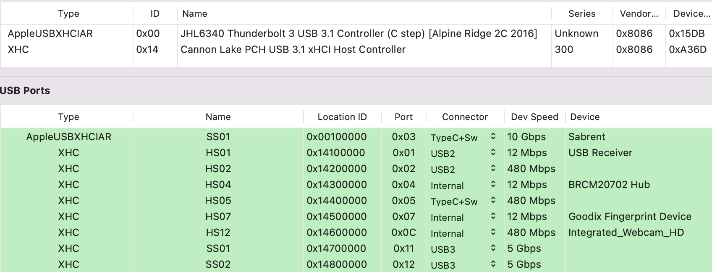

# Dell XPS15-7590 with Opencore 0.8.5
<p align="center">
  
 </p>
 <p align="center">
  
 </p>
 <p align="center">
  
 </p>
 <p align="center">
  
 </p>
  </p>
 <p align="center">
  
 </p>

## Specs
| **Component** | **Model** |
| ------------- | --------- |
| CPU | i7-9750H 6 cores and 12 threads @ 2.6GHz |
| RAM | 2x16GB 2666MHz DDR4 SO-DIMM Crucial CT2K16G4SFRA266 |
| Audio Chipset | Realtek ALC298. Works with Layout-id 30 |
| GPU | Intel UHD Graphics 630 |
| WiFi & Bluetooth | Fenvi BCM94360NG. Works OOB |
| OS Disk | 512GB Samsung 970 Pro |
| macOS | Ventura 13.0/OpenCore 0.8.5

## BIOS
- Press F2 to enter the BIOS. Use latest available bios for the system 1.19.0
- SATA Mode AHCI
- All settings can be turned on, including VT-D.

## UEFI changes
- From Opencore boot screen long press SPACE bar, go to modGRUBShell and set the values for CFG unlock, DVMT Pre-Allocated, DVMT Total Gfx Mem and overclocking lock to the following:
```
setup_var_cv Setup 0x6ED 0x01 0x00
setup_var 0xA10 0x02
setup_var 0xA11 0x03
setup_var_3 0x789 0x00
```

Here is bios table section extracted with UEFITool:
```
0x4C725     One Of: CFG Lock, VarStoreInfo (VarOffset/VarName): 0x6ED, VarStore: 0x1, QuestionId: 0x380, Size: 1, Min: 0x0, Max 0x1, Step: 0x0 {05 91 B0 03 B1 03 80 03 01 00 ED 06 10 10 00 01 00}
0x4C736       One Of Option: Disabled, Value (8 bit): 0x0 {09 07 04 00 00 00 00}
0x4C73D       One Of Option: Enabled, Value (8 bit): 0x1 (default) {09 07 03 00 30 00 01}
0x4C744     End One Of {29 02}

0x54547     One Of: DVMT Pre-Allocated, VarStoreInfo (VarOffset/VarName): 0xA10, VarStore: 0x1, QuestionId: 0x611, Size: 1, Min: 0x0, Max 0xFE, Step: 0x0 {05 91 C8 05 DB 05 11 06 01 00 10 0A 10 10 00 FE 00}
0x54558       Default: DefaultId: 0x0, Value (8 bit): 0x2 {5B 06 00 00 00 02}
0x5455E       One Of Option: 0M, Value (8 bit): 0x0 {09 07 C9 05 00 00 00}
0x54565       One Of Option: 32M, Value (8 bit): 0x1 {09 07 CA 05 00 00 01}
0x5456C       One Of Option: 64M, Value (8 bit): 0x2 {09 07 CB 05 00 00 02}
0x54573       One Of Option: 4M, Value (8 bit): 0xF0 {09 07 CC 05 00 00 F0}
0x5457A       One Of Option: 8M, Value (8 bit): 0xF1 {09 07 CD 05 00 00 F1}
0x54581       One Of Option: 12M, Value (8 bit): 0xF2 {09 07 CE 05 00 00 F2}
0x54588       One Of Option: 16M, Value (8 bit): 0xF3 {09 07 CF 05 00 00 F3}
0x5458F       One Of Option: 20M, Value (8 bit): 0xF4 {09 07 D0 05 00 00 F4}
0x54596       One Of Option: 24M, Value (8 bit): 0xF5 {09 07 D1 05 00 00 F5}
0x5459D       One Of Option: 28M, Value (8 bit): 0xF6 {09 07 D2 05 00 00 F6}
0x545A4       One Of Option: 32M/F7, Value (8 bit): 0xF7 {09 07 D3 05 00 00 F7}
0x545AB       One Of Option: 36M, Value (8 bit): 0xF8 {09 07 D4 05 00 00 F8}
0x545B2       One Of Option: 40M, Value (8 bit): 0xF9 {09 07 D5 05 00 00 F9}
0x545B9       One Of Option: 44M, Value (8 bit): 0xFA {09 07 D6 05 00 00 FA}
0x545C0       One Of Option: 48M, Value (8 bit): 0xFB {09 07 D7 05 00 00 FB}
0x545C7       One Of Option: 52M, Value (8 bit): 0xFC {09 07 D8 05 00 00 FC}
0x545CE       One Of Option: 56M, Value (8 bit): 0xFD {09 07 D9 05 00 00 FD}
0x545D5       One Of Option: 60M, Value (8 bit): 0xFE {09 07 DA 05 00 00 FE}
0x545DC     End One Of {29 02}
0x545DE     One Of: DVMT Total Gfx Mem, VarStoreInfo (VarOffset/VarName): 0xA11, VarStore: 0x1, QuestionId: 0x612, Size: 1, Min: 0x1, Max 0x3, Step: 0x0 {05 91 DC 05 DD 05 12 06 01 00 11 0A 10 10 01 03 00}
0x545EF       Default: DefaultId: 0x0, Value (8 bit): 0x2 {5B 06 00 00 00 02}
0x545F5       One Of Option: 128M, Value (8 bit): 0x1 {09 07 DE 05 00 00 01}
0x545FC       One Of Option: 256M, Value (8 bit): 0x2 {09 07 DF 05 00 00 02}
0x54603       One Of Option: MAX, Value (8 bit): 0x3 {09 07 E0 05 00 00 03}
0x5460A     End One Of {29 02}

0x4C746     One Of: Overclocking Lock, VarStoreInfo (VarOffset/VarName): 0x789, VarStore: 0x1, QuestionId: 0x381, Size: 1, Min: 0x0, Max 0x1, Step: 0x0 {05 91 AC 03 AD 03 81 03 01 00 89 07 10 10 00 01 00}
0x4C757       One Of Option: Disabled, Value (8 bit): 0x0 {09 07 04 00 00 00 00}
0x4C75E       One Of Option: Enabled, Value (8 bit): 0x1 (default) {09 07 03 00 30 00 01}
0x4C765     End One Of {29 02}
```
## What is working/not working
All Apple sevices are working, including Apple TV+.
I am not able to test HDMI Video/Autio ouput, phone jack as well as thunderbolt video output. Touchscreen is not working (work in progress)
Screen brightness control with Fn+F11/F12 is not woring. Use Fn+S/B instead (work in progress). TouchID will not work at all.
Card reader is working. WiFi/Bluetooth working.

## Extra
I'm tripple booting between macOS, Windows 11 and Ubuntu 22.10, using OpenCore as the bootloader. macOS is installed on internal NVMe drive, Windows is running on external NVMe enclosure, connected to USB-C 10GB port, Ubuntu is running on SDCard.